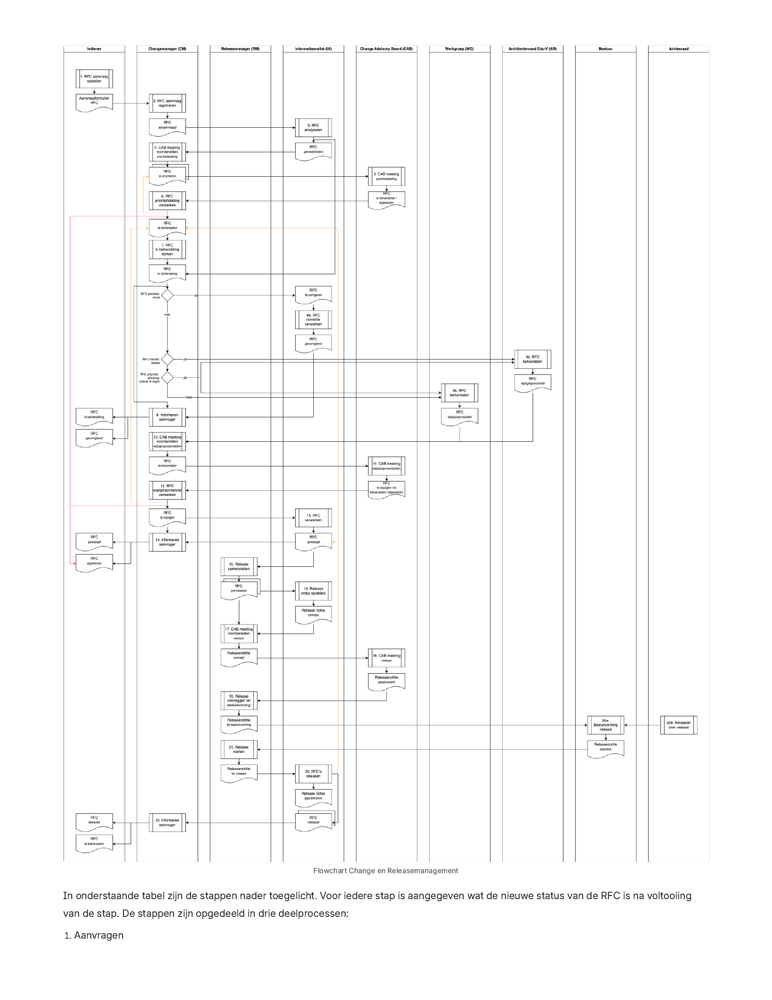

# Change- en releasemanagement proces

| | |
|---|---|
| **Status** | Final - Recommended |
| **Versie** | 1.0 |
| **Beheer** | Stichting Edu-V |
| **Ingangsdatum** | Augustus 2024 |

Via het change- en releasemanagement worden requests for changes (RFC's) zorgvuldig afgewogen en verwerkt als wijzigingen in het afsprakenstelsel van Edu-V. Op deze pagina wordt dit proces nader uitgewerkt. Deze pagina bestaat uit de volgende onderdelen:

- [Actoren en verantwoordelijkheden](#actoren-en-verantwoordelijkheden)
- [RFC labels](#rfc-labels)
  - [Requests for Change (RFC) varianten](#requests-for-change-rfc-varianten)
  - [Statuslabels voor een RFC](#statuslabels-voor-een-rfc)
  - [Prioriteitlabels voor een RFC](#prioriteitlabels-voor-een-rfc)
- [Releaseaanpak en -varianten](#releaseaanpak-en--varianten)
  - [Releaseaanpak tijdens ontwikkeling, implementatie en beheer](#releaseaanpak-tijdens-ontwikkeling-implementatie-en-beheer)
  - [Releasevarianten tijdens de fase van beheer](#releasevarianten-tijdens-de-fase-van-beheer)
- [RFC proces: van aanvragen tot releasen](#rfc-proces-van-aanvragen-tot-releasen)
- [Proces KPI's: response- en doorlooptijden](#proces-kpis-response--en-doorlooptijden)
- [Communicatie over RFC's](#communicatie-over-rfcs)


**Vooraf**

Het change- en releasemanagement proces dat hieronder is uitgewerkt is gedeeltelijk uitgewerkt. Het proces is gericht op RFC's die ingediend worden door kandidaat deelnemers, deelnemers en implementatiepartners en hebben betrekking op de gegevensdiensten die uit de ontwikkeling zijn gekomen of inmiddels geïmplementeerd zijn in een release (versienummers 0.9.Y of hoger).

We voorzien voor de toekomst ook een proces om ontwikkelverzoeken (nieuwe gegevensdiensten), onderzoeksverzoeken (wat is de impact van IA?) en behoeften van scholen een plek te geven. Op basis van de ervaring met het change- en releasemanagementproces wordt nader invulling gegeven aan deze andere typen verzoeken. Hierbij is de afweging of ze passen binnen het change- en releasemanagementproces of vragen om een separaat proces.


## Actoren en verantwoordelijkheden

Bij het change- en releasemanagement proces zijn een aantal actoren betrokken:

| Actor | Omschrijving | Verantwoordelijkheden |
|---|---|---|
| **Indiener** | Een (kandidaat) deelnemer of een implementatiepartner namens meerdere (kandidaat) deelnemers die in de praktijk tegen een issue is aangelopen of een behoefte heeft aan wijziging of uitbreiding van een bestaande afspraak en een RFC indient bij Stichting Edu-V. | <ul><li>Opstellen van aanvraagformulier RFC</li><li>Onderbouwen van nut en noodzaak van RFC</li><li>Uitwerken van globale oplossingsrichting voor issue</li></ul> |
| **Changemanager (CM)** | Een taak van een medewerker van Stichting Edu-V die het proces van intake en behandelen van RFC's uitvoert en begeleidt. | <ul><li>Registratie van RFC's</li><li>Aansturen van behandelen RFC's</li><li>Communicatie met Indieners</li><li>Voorzitter van Change Advisory Board</li></ul> |
| **Releasemanager (RM)** | Een taak van een medewerker van Stichting Edu-V die het samenstellen, de besluitvorming en het uitvoeren van releases begeleidt. | <ul><li>Samenstellen releases</li><li>Begeleiden besluitvorming over releases</li><li>Aansturen van oplevering releases</li></ul> |
| **Informatieanalist (IA)** | Een taak van een medewerker van Stichting Edu-V die de changemanager en releasemanager ondersteunt bij het change en releasemanagement. | <ul><li>Analyseren van RFC's</li><li>Afstemmen met Indiener over de inhoud en onderbouwing van een RFC</li><li>Doorvoeren van correctievoorstellen uit RFC's</li><li>Doorvoeren van wijzigingsvoorstellen uit RFC's</li><li>Opstellen van Release Notes</li><li>Uitvoeren van releases</li><li>Beheren van documentatie</li></ul> |
| **Change Advisory Board (CAB)** | Een groep van experts die RFC aanvragen, wijzigingsvoorstellen en releasenotities beoordeeld en hier advies over geeft.  De Change Advisory Board bestaat uit de volgende leden:<ul><li>Changemanager (Voorzitter)</li><li>Voorzitter Architectenraad Edu-V</li><li>Experts werkgroepen Edu-V</li><li>Afvaardiging implementatiepartners</li></ul> | <ul><li>Prioriteitstelling RFC's bepalen</li><li>Wijzigingsvoorstellen in behandeling nemen en hierover adviseren</li><li>Adviseren over releases</li></ul> |
| **Werkgroep (WG)** | Een werkgroep van Edu-V die één of meerdere praktijksituaties inclusief daartoe behorende referentiecomponten en gegevensdiensten onder beheer heeft. | <ul><li>Inhoudelijk beoordelen van RFC's</li><li>Verder uitwerken en detailleren van een globale oplossingsrichting naar een concreet wijzigingsvoorstel op de specificatie</li><li>Verzorgen van review op het wijzigingsvoorstel door leden van de werkgroep</li></ul> |
| **Architectenraad Edu-V (AR)** | De Architectenraad Edu-V borgt de samenhang van alle afspraken en zorgt ervoor dat afspraken blijven voldoen aan de architectuurprincipes en het architectuurkader. | <ul><li>Beoordelen van RFC's en wijzigingsvoorstellen op inhoudelijke samenhang, voldoen aan de architectuurprincipes en het architectuurkader.</li><li>Inhoudelijk beoordelen van RFC's op het architectuurkader</li><li>Verder uitwerken en detailleren van een globale oplossingsrichting op het architectuurkader naar een concreet wijzigingsvoorstel</li></ul> |
| **Bestuur** | Verantwoordelijk voor de besluitvorming over nieuwe releases van het afsprakenstelsel. | <ul><li>Besluiten over releases</li><li>Indien van toepassing hierover advies inwinnen bij de adviesraad</li></ul> |
| **Adviesraad** | De Adviesraad wordt geconsulteerd door het Bestuur bij releases. | <ul><li>Adviseren over releases</li></ul> |

## RFC labels

Iedere RFC wordt voorzien van meerdere labels. We onderscheiden:

- RFC varianten
- Statuslabels
- Prioriteitslabels

### Requests for Change (RFC) varianten

In het afsprakenstelsel maken we onderscheid vier inhoudelijke varianten van Requests for Changes.

| Variant | Omschrijving | Voorbeelden |
|---|---|---|
| **Beheersing** | Een RFC die effect heeft op de beheerprocessen, dienstenniveaus en de gerelateerde juridisch documenten. | Aanpassing beschikbaarheidsvenster in Dienstenniveaus  Proceswijziging in klachten- en geschillenregeling. |
| **Privacy** | Een RFC die effect heeft op de privacy richtlijnen of de model verwerkersovereenkomst. | Tekstuele wijziging van verwerkersovereenkomst |
| **Gegevensdienst** | Een RFC die effect heeft op (een) gegevensdienst(en) uit één werkgroep. | Nieuw gegevensveld Verwijderen gegevensveld Gegevensveld verplicht in plaats van optioneel Wijziging in een waardelijst Nieuwe gegevensdienst Bug fix in de YAML Aanvulling van de documentatie |
| **Stelsel** | Een RFC die effect heeft op gegevensdiensten uit meerdere werkgroepen, regie op gegevens of het architectuurkader | Aanpassing gegevensveld waar een andere gegevensdienst van afhankelijk is. Wijziging in een NL GOV standaard waarnaar wordt verwezen. Er wordt een afweging gemaakt of deze wijziging al dan niet direct wordt overgenomen. Aanvulling van de documentatie |

### Statuslabels voor een RFC

In onderstaand overzicht is voor een RFC de status weergegeven. Een RFC kan afhankelijk van de variant verschillende stappen doorlopen in het Change- en releasemanagementproces. Bij het bepalen of een RFC in behandeling wordt genomen wordt het [afwegingskader wijzigingen](../afwegingskader-wijzigingen.md) gehanteerd.

De status geeft aan waar in het proces een RFC zich bevindt. In de kolom 'trigger voor' is aangegeven welke actor de volgende stap dient te zetten met betrekking tot de RFC. In de kolom informeren is aangegeven of de indiener op de hoogte wordt gesteld zodra de RFC de status krijgt.

| Statuslabel | Omschrijving | Trigger voor | Informeren |
|---|---|---|---|
| `AANGEVRAAGD` | De RFC is aangevraagd door de indiener en als nieuw aangemaakt op de RFC overzichtspagina. De RFC is nieuw en nog niet inhoudelijk beoordeeld. | IA | – |
| `GEKWALIFICEERD` | De RFC is geanalyseerd, de variant is bepaald en de impact is ingeschat. | CM | Ja |
| `TE PRIORITEREN` | De RFC wordt besproken in de volgende bijeenkomst van de Change Advisory Board om de prioriteitstelling te bepalen. | CAB | – |
| `TE BEHANDELEN` | De RFC is toegevoegd aan de backlog en wordt conform de prioriteitstelling in behandeling genomen. | CM | – |
| `IN BEHANDELING` | De RFC is in behandeling genomen en afhankelijk van de RFC variant belegd bij de werkgroep, werkgroep(en) en/of de Architectenraad Edu-V. | WG en/of AR | Ja |
| `TE CORRIGEREN` | De RFC is toegevoegd aan de backlog van de informatieanalist en de correctie wordt uitgevoerd. | IA | - |
| `GECORRIGEERD` | De RFC heeft geleid tot een correctie in het afsprakenstelsel. De RFC is afgerond | CM | Ja |
| `WIJZIGINGSVOORSTEL` | De RFC heeft geleid tot een wijzigingsvoorstel dat is uitgewerkt in de werkgroep(en) en/of de Architectenraad Edu-V. | CM | Ja |
| `TE BEOORDELEN` | Het wijzigingsvoorstel van de RFC wordt ter beoordeling voorgelegd in de volgende bijeenkomst van de Change Advisory Board | CAB | – |
| `TE WIJZIGEN` | Het wijzigingsvoorstel van de RFC is besproken in de Change Advisory Board en kan verwerkt worden in de afspraken. | IA | – |
| `GEWIJZIGD` | Het wijzigingsvoorstel van de RFC is verwerkt door de informatieanalist in een wijziging van het concept afsprakenstelsel. | RM en CM | Ja |
| `PRE-RELEASE` | De wijziging uit de RFC is geselecteerd voor de aankomende release. | IA en CAB | – |
| `RELEASED` | De wijziging is doorgevoerd in een nieuwe release van het afsprakenstelsel. De RFC is afgerond. | RM en CM | Ja |
| `AFGEWEZEN` | De RFC is afgewezen en wordt niet in behandeling genomen of leidt niet tot correcties en/of wijzigingen van het afsprakenstelsel. De RFC is afgerond. Indien een ander gremium of stakeholder nog een rol kan hebben in het betreffende onderwerp volgt een advies of procesafspraak richting deze belanghebbende. | CM | Ja |

### Prioriteitlabels voor een RFC

Bij het bepalen van de prioriteit wordt gekeken naar de impact van het issue op de werking van de digitale infrastructuur. Deze impact wordt gebruikt om de volgorde te bepalen waarin RFC's worden opgepakt. We maken onderscheid in vijf niveaus.

| Prioriteit | Omschrijving | Voorbeeld | Prioriteit en opvolging |
|---|---|---|---|
| `blocker` | Meerdere ketenprocessen kunnen niet functioneren. Het issue is een showstopper voor de digitale infrastructuur. | Issue met identifiers Issue in OAuth implementatie | Direct opvolging aan geven. In geval van een blocker op een geïmplementeerde gegevensdienst gaat Incident Management in werking. |
| `critical` | Een ketenproces kan niet volwaardig functioneren zodra de wijziging niet is doorgevoerd. Het issue is een showstopper voor het ketenproces. | Endpoint ontbreekt Transactiepatroon is niet werkbaar Kritiek attribuut ontbreekt | Direct opvolging aan geven. |
| `major` | In de bestaande versie of door een extensie is er een workaround waardoor het issue uit de RFC verholpen is. De workaround is echter niet wenselijk voor de lange termijn. | Optioneel veld verplicht maken Ontbrekend item voor waardelijst Ontbrekend attribuut Wijziging in regelgeving | Het issue beschreven in de RFC is geen showstopper maar dermate belangrijk of van toegevoegde waarde dat de wijziging voorrang dient te krijgen. |
| `minor` | De RFC betreft een uitbreiding, wijziging of verbetering van een gegevensdienst. | Wijziging in standaard waarnaar verwezen wordt Nieuw object Nieuwe API | Opvolging zodra de RFC's met een hogere prioriteit verwerkt zijn. |
| `trivial` | De impact is nihil en de wijziging zal niet leiden tot nieuwe of gewijzigde functionaliteit. | Typefout YAML bug | Periodiek of wanneer er tijd over is. |

## Releaseaanpak en -varianten

In deze paragraaf wordt toegelicht op welke wijze releases worden doorgevoerd in het afsprakenstelsel. Allereerst wordt toegelicht wat de releaseaanpak is in de fase van ontwikkeling, implementatie en beheer. Voor de fase van beheer hanteren we een aantal releasevarianten.

### Releaseaanpak tijdens ontwikkeling, implementatie en beheer

Nieuwe releases van het afsprakenstelsel kunnen tot gevolg hebben dat implementaties bij leveranciers aangepast dienen te worden.

Zodra een gegevensdienst voor het eerst wordt geïmplementeerd zijn er nog nagenoeg geen bestaande implementaties en is het mogelijk om vaker te releasen. Hierna hebben we te maken met een situatie van bestaande implementaties en is het minder wenselijk om releases frequent door te voeren.

We onderscheiden daarom voor iedere fase een andere releaseaanpak en hanteren ook een eigen vorm van versiebeheer. Er vindt besluitvorming plaats ten aanzien van de specificaties bij iedere faseovergang:

- Na de fase van ontwikkeling worden de specificaties vastgesteld voor eerste implementatie. Het versienummer wijzigt van een 0.0.X naar de 0.9.0.
- Na de eerste implementatie worden de specificaties vastgesteld als eerste versie van de standaard. Het versienummer wijzigt van een 0.9.Y naar de 1.0.0.
- In de beheerfase vindt besluitvorming ten aanzien van de releases plaats conform het releasemanagementproces.

| Fase | Omschrijving | Releaseaanpak | Versiebeheer |
|---|---|---|---|
| **Ontwikkeling** | De nieuwe gegevensdienst is in ontwikkeling. | Er is nog geen sprake van change- en releasemanagement. In het ontwikkelproces wordt met iteraties gewerkt en komt een afspraak stapsgewijs tot stand. Reviews worden besproken in de werkgroep en leiden volgende iteraties van de documentatie. | 0.0.X waarbij de X bij iedere iteratie wordt opgehoogd. |
| **Implementatie** | De nieuwe gegevensdienst is in eerste implementatie tijdens een voorjaars- of najaarsrelease. | Change en releasemanagement proces is gedeeltelijk van toepassing. Alleen RFC's van de variant Stelsel en Gegevensdienst met de prioriteiten `blocker` en `critical` worden opgepakt als nieuwe release. Geen nieuwe functionaliteit (`major` en `minor`) wordt toegevoegd. Uiteraard worden `trivial` RFC's verwerkt en de correcties doorgevoerd. | 0.9.Y waarbij de Y bij iedere versie wordt opgehoogd. |
| **In beheer** | De gegevensdienst is succesvol geïmplementeerd tijdens een voorjaars- of najaarsrelease door leveranciers. Deze leverancier bieden de gegevensdienst in een productieomgeving aan. In de fase van beheer is er sprake van doorontwikkeling van de gegevensdienst. | Het volledige Change en Releasemanagement is van toepassing inclusief alle RFC varianten en prioriteitslabels. | Semantic versioning conform versiebeheer. |

### Releasevarianten tijdens de fase van beheer

In de fase van beheer is het aantal momenten dat er een release wordt doorgevoerd beperkt. We hanteren hierbij de volgende richtlijn:

| Release | RFC varianten | RFC prioriteiten | Richtlijn |
|---|---|---|---|
| **Hot fix release** | Stelsel Gegevensdienst | `blocker` `critical` | Deze release kan ieder moment uitgevoerd worden aangezien er een issue is met de continuïteit van een ketenproces. |
| **Feature release** | Stelsel Gegevensdienst Beheersing Privacy | `major` `minor` | Deze release wordt periodiek doorgevoerd. Het streven is om releases die niet backwards compatible zijn maximaal 1 keer per jaar door te voeren. |
| **Patch release** | Allen | `trivial` | Deze release wordt periodiek en in hogere frequentie dan de feature release doorgevoerd. |

## RFC proces: van aanvragen tot releasen

Iedere RFC wordt in het change- en releasemanagement behandeld. In onderstaande figuur is het proces nader uitgewerkt. De processtappen worden uitgevoerd door de hierboven genoemde actoren.

In onderstaande tabel zijn de stappen nader toegelicht. Voor iedere stap is aangegeven wat de nieuwe status van de RFC is na voltooiing van de stap. De stappen zijn opgedeeld in drie deelprocessen:

1. Aanvragen
2. Prioriteren
3. Behandelen
4. Releasen

| Stap | Toelichting | Nieuwe status |
|---|---|---|
| **Aanvragen** | | |
| 1 | De Indiener dient een RFC in en stelt hiervoor een aanvraagformulier op. Dit aanvraagformulier bestaat uit de volgende onderdelen:<ul><li>De indiener(s) van de RFC</li><li>Contactpersoon</li><li>Op welke afspraak heeft de RFC betrekking</li><li>Verwijzing naar de betreffende Confluence pagina</li><li>Voorgestelde wijziging</li><li>Rationale voor de voorgestelde wijziging</li><li>Gewenste invoeringstijdstip van de RFC</li></ul> | – |
| 2 | De CM registreert de aanvraag van de RFC en meldt aan de Indiener dat de RFC in goede orde is ontvangen. | `AANGEVRAAGD` |
| **Prioriteren** | | |
| 3 | De IA analyseert de RFC en consulteert de Indiener en indien van toepassing een expert uit de werkgroep of de Architectenraad Edu-V en voorziet de RFC van aanvullende informatie:<ul><li>De RFC variant</li><li>Het statuslabel</li><li>Het prioriteitslabel</li><li>Een inhoudelijk advies aan de CM en de CAB voor verdere opvolging. Uit dit advies blijkt:<ul><li>De rationale voor toekennen van de RFC variant en het prioriteitslabel.</li><li>Of de RFC in behandeling zou moeten worden genomen of afgewezen kan worden.</li><li>Indien het advies is om de RFC af te wijzen dan bevat het advies hier een onderbouwing voor</li></ul></li></ul>Bij het bepalen van het prioriteitslabel en het formuleren van het advies kan de IA gebruik maken van het [afwegingskader wijzigingen](../afwegingskader-wijzigingen.md).  Indien de prioriteit van de RFC is ingeschaald als `blocker`, `critical` of `trivial` dan wordt de status gewijzigd naar `IN BEHANDELING`. Voor de andere prioriteiten wordt de status aangepast naar `GEKWALIFICEERD`.  Op deze manier zorgen we ervoor dat de RFC's die de continuïteit van de digitale infrastructuur in het geding brengen direct opgevolgd worden. De stap van prioriteitstelling door de CAB wordt overgeslagen. | `GEKWALIFICEERD` `IN BEHANDELING` |
| 4 | De CM bereidt de CAB meeting voor en verzamelt alle gekwalificeerde RFC's en bepaalt welke RFC's in de volgende CAB meeting besproken gaan worden. | `TE PRIORITEREN` |
| 5 | In de CAB meeting worden de RFC's met het statuslabel `TE PRIORITEREN` besproken en wordt bepaald welke RFC's in de komende periode worden behandeld. Tijdens de bijeenkomst wordt bepaald of de RFC:<ul><li>Nog niet behandeld gaat worden (status blijft `TE PRIORITEREN`)</li><li>Behandeld gaat worden (status wijzigt naar `TE BEHANDELEN`)</li><li>Niet in behandeling wordt genomen (status wijzigt naar `AFGEWEZEN`)</li></ul> | – |
| 6 | De CM verwerkt de uitkomsten van de CAB meeting en zorgt voor de statuswijzigingen. | `TE PRIORITEREN` `TE BEHANDELEN` `AFGEWEZEN` |
| **Behandelen** | | |
| 7 | De CM neemt alle RFC's initieert het proces van behandelen voor alle RFC's met de status `TE BEHANDELEN`. Afhankelijk van de RFC variant en/of de prioriteitstelling wordt de behandeling uitgevoerd door:<ul><li>De IA voor RFC's met een prioriteit `trivial`.</li><li>De werkgroep Beheersing voor de RFC variant Beheersing.</li><li>De Keten Adviesgroep Privacy voor de RFC variant Privacy.</li><li>De relevante werkgroepen voor de RFC variant Gegevensdienst.</li><li>De Architectenraad Edu-V voor de RFC variant Stelsel en alle RFC's met de prioriteitstelling `blocking`, `critical` en `major`.</li></ul>Voor RFC's met een prioriteit van `blocker` of `critical` organiseert de CM het versnelde proces. Dit betekent:<ul><li>Inplannen van een aanvullende CAB meeting.</li><li>Voorbereiden van een hot fix release en dit beleggen bij de Informatieanalist.</li><li>Informeren van het Bestuur en in overleg bepalen op welke wijze de besluitvorming wordt gedaan op de hot fix release.</li></ul> | `IN BEHANDELING` |
| 8 | Na het in behandeling nemen informeert de CM de indiener over de volgende stap. | |
| 9 | De RFC wordt behandelt conform de op de RFC van toepassing zijnde behandelroute:<ul><li>De RFC leidt tot een correctie die doorgevoerd wordt door de IA.</li><li>De RFC wordt besproken, geanalyseerd en geadresseerd in de relevante werkgroep(en) en/of de Architectenraad Edu-V en leidt tot een wijzigingsvoorstel.<ul><li>Bij het behandelen van de RFC kan advies worden ingewonnen bij experts en adviseurs. Een voorbeeld is juridisch advies over een wetswijziging of technisch advies over een wijziging in een standaard waar naar wordt verwezen.</li></ul></li></ul> | `WIJZIGINGSVOORSTEL` `GECORRIGEERD` |
| 10 | De CM bereidt de CAB meeting voor en verzamelt alle RFC's met de status `WIJZIGINGSVOORSTEL` en agendeert deze voor het overleg. | `TE BEOORDELEN` |
| 11 | In de CAB meeting worden alle wijzigingsvoorstellen besproken en wordt de vervolgstap bepaald:<ul><li>Het wijzigingsvoorstel is akkoord en kan worden verwerkt (`TE WIJZIGEN`).</li><li>Het wijzigingsvoorstel is niet akkoord en dient opnieuw in behandeling te worden genomen (`TE BEHANDELEN`).</li><li>In het wijzigingsvoorstel is onderbouwd dat geen wijziging noodzakelijk is en de RFC wordt alsnog afgewezen (`AFGEWEZEN`).</li></ul> | `TE WIJZIGEN` `TE BEHANDELEN` `AFGEWEZEN` |
| 12 | De CM verwerkt de uitkomsten van de CAB meeting en zorgt voor de statuswijzigingen. De RFC's met de status `TE WIJZIGEN` worden gecommuniceerd naar de IA zodat deze de wijzigingen kan verwerken. | `TE BEHANDELEN` `TE WIJZIGEN` `AFGEWEZEN` |
| 13 | De IA verwerkt de wijzigingen in de ontwikkelomgeving van het Afsprakenstelsel. | `GEWIJZIGD` |
| 14 | De CM informeert de indiener over de voortgang van de RFC. Dit kan een melding zijn dat de RFC opnieuw in behandeling wordt genomen, verwerkt gaat worden of dat deze alsnog is afgewezen. | |
| **Releasen** | | |
| 15 | De RM selecteert de RFC's met de status `GEWIJZIGD` en stelt hier een release voor samen. | `PRE-RELEASE` |
| 16 | De IA werkt de concept release notes uit. In de release notes worden de wijzigingen samengevat. De IA maakt hiervoor gebruik van de registratie van de RFC's die zijn opgenomen in de release. | |
| 17 | De RM bereidt de CAB voor waarin de aankomende release wordt besproken. De RM stelt een releasenotitie op waarin de selectie van RFC's wordt onderbouwd, de concept release notes zijn opgenomen en de belangrijkste wijzigingen worden toegelicht. | |
| 18 | Het CAB bespreekt de releasenotitie en gaat al dan niet akkoord met de samenstelling van de release. Het CAB kan adviseren om de selectie van RFC's te wijzigen of verbetersuggesties doen voor de releasenotes en de onderbouwing van de keuzes. | |
| 19 | De RM verwerkt de adviezen van het CAB in de Releasenotitie en legt deze ter besluitvorming voor aan het Bestuur. | |
| 20 | Het Bestuur bespreekt en besluit over de Release. Er kan besloten worden om akkoord te gaan met de release, akkoord te gaan met een gedeelte van de release of niet akkoord te gaan met de release.  Het Bestuur consulteert bij een majeure release de Adviesraad. Dit betreft de Feature release in de fase van beheer. De Hot fix en de patch release worden niet voorgelegd aan de Adviesraad.  In aanvulling hierop worden ook de faseovergang van ontwikkeling naar implementatie (van versie 0.0.X naar 0.9.0) en de faseovergang van implementatie naar beheer (van versie 0.9.Y naar 1.0.0) voorgelegd aan de Adviesraad. | |
| 21 | De RM start het releasen en geeft opdracht aan de IA om de release door te voeren. | |
| 22 | De IA voert de release door naar de productieomgeving van het afsprakenstelsel. Een nieuwe versie van de documentatie komt online. De release notes worden gepubliceerd en de RFC's wijzigen naar de status `RELEASED`.  RFC's die na besluitvorming toch geen onderdeel worden van de release worden van status gewijzigd naar `GEWIJZIGD` of `TE BEHANDELEN`. | `RELEASED` `GEWIJZIGD` `TE BEHANDELEN` |
| 23 | De CM (let op: dit is dus niet de RM) informeert de indiener over de voortgang van de RFC. Dit kan een melding zijn dat de RFC opnieuw in behandeling wordt genomen of gereleased wordt. Indien een wijziging toch niet gereleased wordt verandert de status feitelijk niet (deze blijft `GEWIJZIGD`) en wordt er niets gecommuniceerd. | |

## Proces KPI's: response- en doorlooptijden

Om het change- en releasemanagement optimaal te laten verlopen hebben we voor ieder van de processen maximale doorlooptijden gedefinieerd:

| Proces | Proces KPI's | Regulier | `blocker` of `critical` |
|---|---|---|---|
| **Aanmelden** | Maximale reactietermijn door CM na indienen aanvraagformulier RFC | 3 werkdagen | 1 werkdag |
| | Maximale doorlooptijd kwalificatie van RFC door IA | 5 werkdagen | 1 werkdag |
| | Prioriteitstelling van nieuwe RFC's door het CAB | maandelijks | n.v.t. |
| **Behandelen** | Maximale reactietermijn en verwerkingstermijn voor behandelen van RFC's met prioriteit `trivial` door IA. | 2 weken | n.v.t. |
| | Maximale doorlooptijd behandeling van RFC met prioriteit `major` door werkgroep en/of Architectenraad Edu-V. | 2 maanden | n.v.t. |
| | Maximale doorlooptijd behandeling van RFC met prioriteit `minor` door werkgroep en/of Architectenraad Edu-V. | 4 maanden | n.v.t. |
| | Maximale doorlooptijd behandeling van RFC met prioriteit `blocker` of `critical` door werkgroep en/of Architectenraad Edu-V. | n.v.t. | 1 week |
| | Beoordeling van wijzigingsverzoeken van RFC door het CAB. | Iedere maand | Op afroep, gepland zodra RFC in behandeling wordt genomen. |
| | Maximale doorlooptijd wijziging van RFC door IA. | 2 weken | 2 werkdagen |
| **Releasen** | Doorlooptijd samenstellen van een release door de RM | 2 werkdagen | n.v.t. |
| | Doorlooptijd opstellen van release notes door de IA | 2 werkdagen | n.v.t. |
| | Doorlooptijd opstellen van de releasenotitie door de RM | 2 werkdagen | n.v.t. |
| | Doorlooptijd advies over de releasenotitie door het CAB | 7 werkdagen | n.v.t. |
| | Doorlooptijd besluitvorming over de releasenotitie door het bestuur | 7 werkdagen | n.v.t. |
| | Doorlooptijd doorvoeren van de release door de IA | 1 werkdag | n.v.t. |
| | Doorlooptijd van samenstellingen tot besluitvorming over een Hot fix release | n.v.t. | 3 werkdagen |

## Communicatie over RFC's

RFC's kunnen ingediend worden door (kandidaat) deelnemers of door een implementatiepartner namens meerdere (kandidaat) deelnemers. Hiervoor wordt een mogelijkheid beschikbaar gemaakt binnen een besloten omgeving voor deze partijen.

Na aanmelden van een RFC wordt deze publiek geregistreerd door de CM. Alle wijzigingen, de statusinformatie en de prioriteitslabels worden bijgewerkt zodat alle leveranciers de voortgang op het RFC kunnen volgen. Het verdient de voorkeur om een tool te kiezen die het voor leveranciers mogelijk maakt om zich te kunnen abonneren op de wijzigingen die plaatsvinden in een RFC of een bepaalde gegevensdienst. Zo kunnen leveranciers zelf bepalen op welke wijze ze op de hoogte worden gehouden. Daarnaast dient de publicatie ook stakeholders. Zo kunnen zij zien of wensen voor wijzigingen al ingebracht zijn of dat deze ook opgepakt gaan worden.

De CM verzorgt de communicatie met de indiener en zal proactief de stand van zaken met de Indiener bespreken. De IA zal ook contact hebben met de Indiener voor inhoudelijke afstemming over de RFC.

---


**Release notes**

Deze uitwerking is gebaseerd op basis van de volgende stappen:

- 0.0.1: De globale uitwerking van Change en releasemanagement en het Change- en releasemanagement proces zijn nader uitgewerkt. Hierbij zijn inhoudelijk aangevuld:
  - De actoren die betrokken zijn bij het change- en releasemanagementproces.
  - De RFC varianten
  - De RFC prioriteitlabels
  - De releaseaanpakken voor de fasen van ontwikkeling, implementatie en beheer
  - De releasevarianten voor de fase van beheer
  - Een flowchart waar
  - KPI's voor het proces
- 0.0.2: Feedback uit programmateam verwerkt.
- 0.0.3: Feedback uit programmateam verwerkt.
- 0.0.4: Feedback uit werkgroep Beheersing verwerkt.
- 1.0.0 Vaststelling 1.0 versie door BO na toetsing in Najaarsrelease 2024

